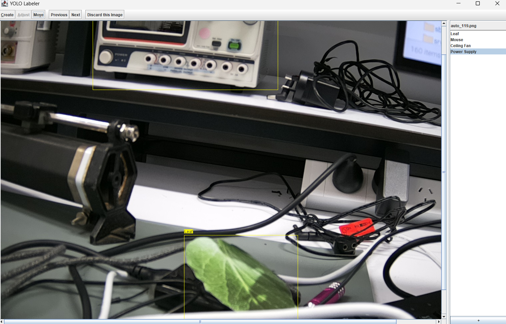

# Yolo Labeler Java

Simple utility for labeling training data for YOLO models.

## Usage

Extract images into images directory and simply run the program. Corresponding .txt files will be made
for each image in a labels/ subdirectory, containing the boxes. Mappings from number to label name will be saved in a special file,
`object_labels.xml`.

